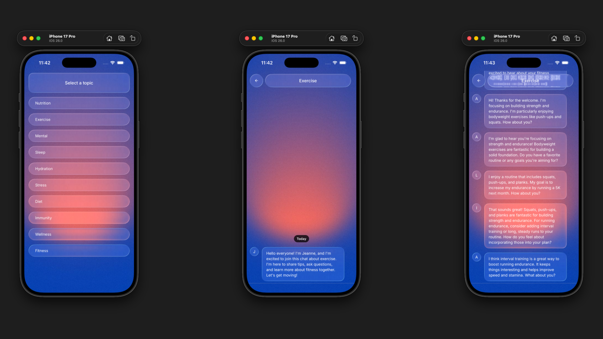

# LiquidChat

[](https://github.com/artyorsh/liquid-chat/actions?query=branch%3Amain+event%3Apush)
[](https://github.com/artyorsh/liquid-chat/actions?query=branch%3Amain+event%3Aschedule)

## Description

LiquidChat - a showcase of on-device AI capabilities using Apple Foundation Models, MLC LLM Engine and Vercel AI SDK.

[Demo](./screenshots/demo.gif).



## Stack

- [](https://github.com/expo/expo/blob/main/packages/expo/CHANGELOG.md)
- [](https://github.com/facebook/react-native/releases)
- [](https://github.com/react-navigation/react-navigation/releases)
- [](https://github.com/vitalets/react-native-unistyles/releases)
- [](https://github.com/callstackincubator/ai/releases)
- [](https://github.com/mobxjs/mobx/releases)
- [](https://github.com/inversify/InversifyJS/releases)
- [](https://github.com/jestjs/jest/releases)
- [](https://github.com/callstack/react-native-testing-library/releases)
- [](https://github.com/microsoft/TypeScript/releases)
- [](https://github.com/eslint/eslint/releases)

## Features

- On-device LLMs via Apple Foundation Models or MLC LLM Engine.
- AI-generated chat topics and group conversations.
- Light and Dark themes with flexible customization.
- CI/CD with GitHub Actions and EAS.
- Modularized architecture with Dependency Injection.

## Requirements

- For Apple Foundation Models, MacOS 26 with Xcode 26 are required.
- No above restrictions for MLC models. However, [testing is limited](#running).

## Setup

Install [Bun](https://github.com/oven-sh/homebrew-bun#install).

```bash
bun i
```

```bash
cp .env.example .env
# (Optionally) update the EXPO_PUBLIC_AI_FALLBACK_MODEL
```

## Running

Start Metro bundler and follow the instructions in terminal to run the app.

```bash
bun run start
```

### Android

Not testable. The library has runtime errors when attempting to load the model after download.

### iOS

MLC models require a physical device, making them not testable on Simulator.

**Mac / Physical device**:
- Build Xcode project: `npx expo prebuild` > `open ios/liquidchat.xcworkspace`
- Select "My Mac (Designed for iPhone)" as running destination
- Adjust Signing & Capabilities with your Personal Team

**Simulator**:
- Remove MLC deps: `bun rm @react-native-ai/mlc` > `npx expo prebuild --clean` > then adjust the [ai/index](src/ai/index.ts) to always return AppleAIProvider.

## Other apps

[Schiffradar](https://github.com/artyorsh/schiffradar)

## Author

[Artur Yersh](https://artyorsh.me)
